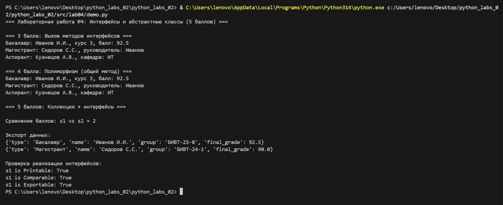

# Лабораторная работа №4: Интерфейсы и абстрактные классы
## Цель
Изучить абстрактные классы, интерфейсы, полиморфизм на основе интерфейсов, реализовать требования на 5 баллов.

## Структура
- interfaces.py — интерфейсы Printable, Comparable, Exportable
- models.py — классы, реализующие интерфейсы
- demo.py — демонстрация

## Реализованные интерфейсы
- Printable — метод to_string()
- Comparable — метод compare_to()
- Exportable — метод export_info()

## Выполнены требования
- 3 балла: Создано 3 интерфейса, реализовано в классах
- 4 балла: Полиморфизм, общие функции
- 5 баллов: Интеграция с коллекцией, проверка интерфейсов, сравнение, экспорт

## Вывод
Изучены принципы работы с интерфейсами, полиморфизмом и абстрактными классами.
