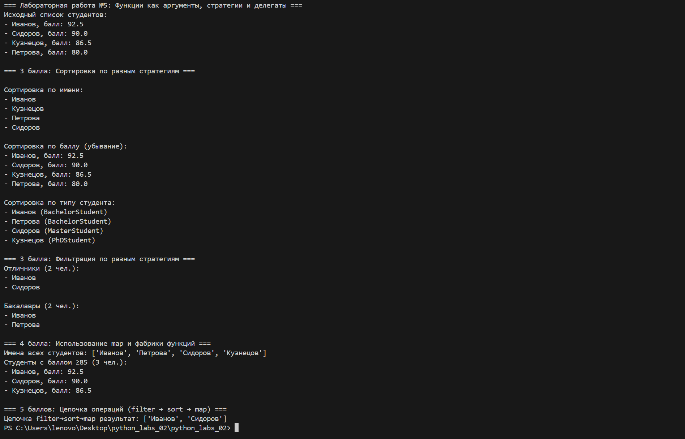

# Лабораторная работа №5
## Цель работы
Изучить передачу функций как аргументов, освоить работу с функциями высшего порядка (map, filter, sorted), реализовать паттерн «Стратегия» и интегрировать функциональный подход в существующий код из предыдущих лабораторных работ.

## Описание реализации
### 1. Функции-стратегии
В файле strategies.py реализованы независимые функции:
- Сортировка: по имени, по среднему баллу, по типу студента
- Фильтрация: отличники, бакалавры, студенты со стипендией
- Преобразование: получение имени студента

### 2. Расширение класса StudentCollection
В коллекцию добавлены новые методы:
- sort_by — сортировка с передачей функции-ключа
- filter_by — фильтрация по предикату
- apply — применение функции ко всем элементам (аналог map)

### 3. Демонстрация
В demo.py продемонстрировано:
- Создание коллекции студентов
- Сортировка по разным стратегиям
- Фильтрация по разным условиям
- Использование фабрики функций для создания фильтров
- Цепочка операций filter → sort → map
- Работа методов с передачей функций как аргументов

## Результаты выполнения
Реализованы все требования на 3, 4 и 5 баллов. Код соответствует функциональному стилю, паттерну «Стратегия», поддерживает гибкую замену логики сортировки и фильтрации без изменения основного класса. Программа работает корректно, все методы и функции протестированы.

## Вывод
В ходе лабораторной работы изучены принципы передачи функций как аргументов, функции высшего порядка, реализован паттерн «Стратегия». Код стал гибким, расширяемым и соответствует требованиям современного программирования.

