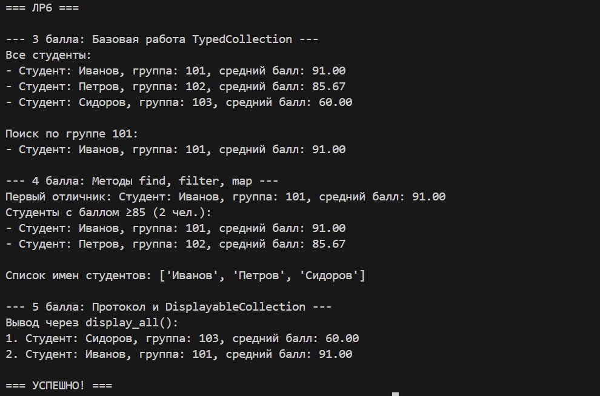

# Лабораторная работа №6 — Типизация и Обобщённые Коллекции
```markdown
# Лабораторная работа №6
## Тема: Аннотации типов, обобщённые классы и протоколы в Python

---

## 1. Цель работы
1.  Освоить использование **аннотаций типов** для классов и методов Python.
2.  Научиться создавать **обобщённые (Generic) классы** с помощью `TypeVar` и `Generic`.
3.  Понять и реализовать **структурную типизацию** (утиная типизация) через `typing.Protocol`.
4.  Создать типизированный контейнер, повторяющий функциональность коллекции из ЛР-2.

---

## 2. Описание реализации

### 2.1. Типизация классов из ЛР-1
В существующие классы `Student`, `BachelorStudent`, `MagisterStudent` из ЛР-1 были добавлены полные аннотации типов для:
- Параметров конструктора
- Атрибутов класса
- Возвращаемых значений всех методов

Пример:
```python
class Student:
    def __init__(self, name: str, group: str, grades: List[int]) -> None:
        self.name: str = name
        self.group: str = group
        self.grades: List[int] = grades
```

### 2.2. Обобщённый контейнер `TypedCollection[T]`
Создан универсальный контейнер `TypedCollection`, реализующий интерфейс коллекции из ЛР-2, но с полной типизацией.

**Основные методы (перенесены из ЛР-2):**
- `add(item: T)`, `remove(item: T)`: Добавление и удаление элементов.
- `get_all() -> List[T]`: Получение копии всех элементов.
- `find_by_name()`, `find_by_group()`: Поиск по атрибутам.
- `sort_by_name()`, `sort_by_final_grade()`: Сортировка элементов.
- Магические методы `__len__`, `__iter__`, `__getitem__`.

**Методы для 4 балла:**
- `find(predicate) -> Optional[T]`: Поиск первого элемента по условию.
- `filter(predicate) -> List[T]`: Отбор элементов по условию.
- `map(transform) -> List[R]`: Преобразование элементов с изменением типа.

### 2.3. Протоколы и ограниченные коллекции (5 баллов)
Определён протокол `Displayable`, который требует реализацию метода `display() -> str`.
```python
class Displayable(Protocol):
    def display(self) -> str: ...
```
На его основе создан ограниченный контейнер `DisplayableCollection[T]`, который может хранить только объекты, удовлетворяющие протоколу.

Класс `Student` не наследуется явно от протокола, но автоматически ему соответствует, так как реализует требуемый метод `display()`.

---

## 3. Демонстрация работы (demo.py)
Скрипт `demo.py` демонстрирует выполнение всех заданий:

### 3.1. Задание на 3 балла
Базовая работа с типизированной коллекцией `TypedCollection[Student]`.
- Создание коллекции и добавление студентов.
- Поиск студентов по группе.

### 3.2. Задание на 4 балла
Использование методов `find`, `filter`, `map`.
- `find`: Поиск первого студента с баллом ≥90.
- `filter`: Отбор студентов с баллом ≥85.
- `map`: Преобразование списка студентов в список их имён.

### 3.3. Задание на 5 баллов
Работа с протоколом `Displayable`.
- Создание `DisplayableCollection`.
- Добавление студентов и вызов метода `display_all()`.

**Скриншот вывода программы:**


## 4. Вывод
В ходе выполнения лабораторной работы были изучены и реализованы:
1.  **Аннотации типов** для классов, атрибутов и методов, что улучшает читаемость и безопасность кода.
2.  **Обобщённые классы** на примере универсального контейнера `TypedCollection`, который может работать с объектами любого типа.
3.  **Протоколы** как средство реализации структурной типизации, позволяющее создавать гибкие и слабосвязанные интерфейсы.
4.  Перенос всей функциональности коллекции из ЛР-2 в типизированный контейнер.

Работа выполнена в полном объёме, все задания на 3, 4 и 5 баллов реализованы.
```